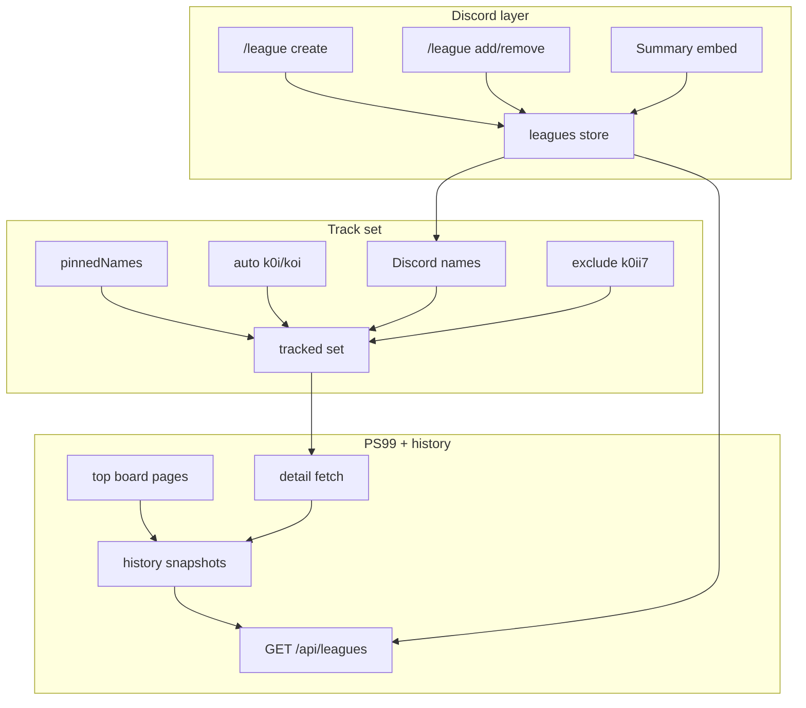

# Prompt: KOii Leagues system (how the Discord bot thinks)

Paste into Cursor when rebuilding leagues (bot and/or backend). This documents **how the existing Discord bot leagues work** — two systems under one `/league` command. There is no separate `lib/` module; original logic lives in one `bot.js`. Rebuild modularly if you want; preserve behavior.

---

## Prompt (copy from here)

You are implementing a **Leagues** feature like the KOii Discord bot. Read this whole spec before coding. Match the mental model and data shapes; do not invent a different product.

### Mental model (critical)

**“League” means two different things that share a name:**

| Layer | What it is | Stored where (legacy bot) |
|-------|------------|---------------------------|
| **A. Discord leagues** | In-server social teams: 1 owner + up to 3 members (Discord user IDs). Free-text name ≤32 chars. | `leagues.json` → `leagues[]` |
| **B. PS99 / Big Games leagues** | Real in-game leagues from Pet Simulator 99 API. Points, ranks, contributions. | Fetched live + snapshotted into `league_history.json` |

**Bridge:** Discord league `name` is the lookup key for PS99 `GET /v1/leagues/{name}`. If names match (case-insensitive intent), Discord roster row gets a `live` PS99 block. Typo → Discord team still exists, `live` is null / error.

Creating a Discord league does **not** create anything on PS99. Tracking does **not** require a Discord team (pins / auto-prefix can track external names).

### Constants (legacy defaults)

| Name | Value | Meaning |
|------|-------|---------|
| `LEAGUE_CHANNEL_ID` | Discord channel snowflake | All `/league` cmds except `channel` must run here; summary embed lives here |
| `LEAGUE_MAX_MEMBERS` | `3` | Extra seats beyond owner → total 4 people |
| `LEAGUE_AUTO_TRACK_PREFIXES` | `["k0i", "koi"]` | Auto-track PS99 leagues whose name starts with these (lowercase) |
| `LEAGUE_TRACKING_EXCLUDED_NAMES` | `{"k0ii7"}` | Never auto/pin-track (Discord create still allowed) |
| Snapshot interval | **5 minutes** | Same cadence as clan war snapshots in the old bot |
| History retention | **7 days** | Prune older snapshots |
| History write debounce | **60 seconds** | Skip write if last snap too recent |
| Top board fetch | up to **4 pages × 100** (~400) | UI usually shows top 100 |

Put channel / role gates in your Discord config file if the new bot uses one.

### Permissions

| Action | Who |
|--------|-----|
| `create` | Clan member tier+ (low role) |
| `add` / `remove` / `disband` | Owner of that Discord league only |
| `view` | Anyone, but only in league channel |
| `track` / `untrack` / `channel set|view` | Officer tier+ |
| `clearall` | Owner-admins only |

Global `/league` command is registered for everyone; finer gates inside subcommands. **Channel rule:** every subcommand except `channel` must run in the configured league channel (else ephemeral reject).

### Data shapes

#### Discord store (`leagues.json` legacy → Prisma tables OK)

```json
{
  "leagues": [
    {
      "id": "league_1710000000000_ab12",
      "name": "K0I3",
      "ownerId": "123456789012345678",
      "memberIds": ["234567890123456789"],
      "createdAt": 1710000000000
    }
  ],
  "pinnedNames": ["SomeExternalLeague"],
  "channelId": "1517634446281412809",
  "leagueSummaryMessageId": "987654321098765432"
}
```

| Field | Notes |
|-------|--------|
| `leagues[].id` | `league_${Date.now()}_${random}` |
| `leagues[].name` | Display + PS99 lookup key; unique case-insensitive among Discord leagues |
| `leagues[].ownerId` | Discord snowflake |
| `leagues[].memberIds` | Discord snowflakes; max 3; owner not in this array |
| `pinnedNames` | Extra PS99 names for website tracker (officer `/league track`) |
| `channelId` | Override for default league channel |
| `leagueSummaryMessageId` | Last “K0ii Leagues” embed message (delete+repost pattern) |

**Rules:**

- One Discord league **ownership** per user (cannot create second while owning one).
- `add` does **not** check if the user is already in another Discord league (only blocks duplicate in *this* league / self / full).
- Name uniqueness among Discord leagues only — not validated against PS99 existence on create.

#### History store (`league_history.json` legacy)

Array of snapshots:

```json
[
  {
    "timestamp": 1710000000000,
    "leagues": {
      "<ps99LeagueId>": {
        "id": "<ps99LeagueId>",
        "name": "Koi",
        "points": 388781,
        "members": 4,
        "contributorCount": 4,
        "memberPoints": {
          "<robloxUserId>": 98174
        }
      }
    }
  }
]
```

- Key by **PS99 league id**, not name.
- `memberPoints` only when detail fetch had contributions (tracked Discord / auto / pinned). Bare top-board rows may omit it.
- Keep last 7 days; debounce writes &lt;60s apart.

### PS99 HTTP (legacy bot called these directly)

Base: `https://ps99.biggamesapi.io`  
Expect `{ status: "ok", data }` unwrap.

| Purpose | Method |
|---------|--------|
| Top board | `GET /v1/leagues?page=&pageSize=100&sort=Points&sortOrder=desc` |
| Prefix search (auto-track) | same + `&search=k0i` or `koi`, then filter `nameLower.startsWith(prefix)` |
| Detail | `GET /v1/leagues/{encodeURIComponent(name)}` — roster, owner, PointContributions |

Normalize PascalCase → camelCase (`Name`, `ID`, `Points`, `Members`, `MemberCapacity`, `ContributorCount`, `Icon`, `Owner`, `Created`, …).

Resolve Roblox display names / icon thumbnails when building API payload for the site (legacy used Roblox users + thumbnails APIs).

**If rebuilding in a monorepo where the Discord bot is backend-only:** put all PS99 + history writes in `apps/api` (or poll job). Bot only does Discord CRUD + embed + calls `GET /api/leagues`. Do not call PS99 from `apps/bot`.

### Tracked name set (each snapshot)

```
tracked = unique(
  discordLeagueNames
  ∪ autoPrefixMatches (k0i/koi)
  ∪ pinnedNames
) − excludedNames (k0ii7)
```

For each tracked name → detail fetch → merge into history map by PS99 id (overlay contributions onto top-board rows when present).

### Derived stats (from history)

Compare current points vs older snapshots:

- `delta5m`, `delta30m`, `delta60m`
- `pph`, `ppd` (points per hour / day style rates)
- Per-member PPH from `memberPoints` nearest ~1h-ago snap when possible
- `rankHistory`: ~24h series with ≥30min spacing; rank ≈ count of leagues with higher points in that snapshot (not necessarily official Big Games rank unless top board is complete)

### Slash command `/league` behavior

| Subcommand | Behavior |
|------------|----------|
| `create name` | Low tier + league channel. Reject if already owns league or name taken. Append Discord league. Save. Refresh summary embed. |
| `add user` | Owner only. Reject self / already in this league / full. Push `memberIds`. Refresh embed. |
| `remove user` | Owner only. Pull from `memberIds`. Refresh embed. |
| `disband` | Owner only. Delete own league. Refresh embed. |
| `view` | Ephemeral text list of **Discord** leagues only (names, owners, members) — **not** PS99 standings. |
| `clearall` | Owner-admin. Wipe Discord leagues; clear summary message id; re-post empty embed. |
| `track name` | Officer. Add to `pinnedNames` if not Discord-managed / excluded / already pinned. |
| `untrack name` | Officer. Remove from `pinnedNames`. |
| `channel set` | Officer. Set `channelId`; move summary embed there. |
| `channel view` | Officer. Show current league channel. |

**There is no `/league standings`.** Real standings = website / `GET /api/leagues`.

### Discord UX — summary embed

- Title: **“K0ii Leagues”** (or brand equivalent)
- Color: warm orange (`0xff8f3d` legacy)
- Body: each Discord league — name, owner mention, member mentions, `(n/3)` capacity
- Empty copy: tell users to `/league create`
- Pattern: **delete** previous `leagueSummaryMessageId`, **send** new message (keeps embed near bottom of channel). Failures on delete can be ignored silently.

All command replies ephemeral.

### Background job

Every **5 minutes** (and optionally on API read in legacy — prefer **not** writing history on every GET in a rebuild):

1. Fetch top board pages + auto-prefix searches  
2. Detail-fetch all tracked names  
3. Enrich with history deltas / PPH  
4. Upsert history snapshot (debounce + 7-day prune)  
5. Return / cache payload for `GET /api/leagues`

### HTTP API contract — `GET /api/leagues`

Shape the site expects (legacy bot):

```ts
{
  status: "ok",
  generatedAt: number,
  leagues: Array<{
    // Discord-managed:
    id: string;           // league_* | auto_* | pinned_*
    name: string;
    owner?: { id, tag?, displayName? };
    members?: Array<{ id, tag?, displayName? }>;
    capacity: number;     // Discord-managed: 3; auto/pinned often memberCapacity-1
    autoTracked?: boolean;
    pinned?: boolean;
    live: null | {
      id, name, nameLower, rank, icon, avatarUrl,
      points, members, memberCapacity, contributorCount,
      ownerUserId, created, owner, roster, contributions,
      pph, ppd, delta5m, delta30m, delta60m
      // contributions may include per-member pph
    },
    error: string | null,
    rankHistory: Array<{ t: number; rank: number; points: number }>
  }>,
  top100: /* ranked rows with pph/deltas/avatarUrl */,
  leaderboard: /* fuller board ≤~400 */,
  historyLength: number
}
```

Id prefixes:

- Discord-managed: `league_…`
- Auto-tracked only: `auto_{ps99Id}`
- Pinned only: `pinned_{nameLower}`

Merge so a Discord-managed name that also matches PS99 appears **once** with roster + `live`.

### Flows

#### Create Discord league

1. In league channel + low tier  
2. Name length ≤32, unique CI, user does not already own a league  
3. Persist `{ id, name, ownerId, memberIds: [], createdAt }`  
4. Refresh summary embed  
5. Next snapshot will try PS99 detail by that name  

#### Add member

1. League where `ownerId === caller`  
2. Capacity / self / duplicate checks  
3. Persist + refresh embed  

#### Snapshot points

1. Build tracked name set  
2. Fetch PS99 list + details  
3. Write history snapshot keyed by PS99 id  
4. Compute deltas vs prior snaps for API  

#### View standings

- Discord `/league view` → Discord teams only  
- Site → `GET /api/leagues` → sort by `live.rank` / points; show top100 + tracked cards + rank history  

#### Track external league

1. Officer + league channel  
2. Reject excluded / Discord-managed / already pinned  
3. `pinnedNames.push(name)`  
4. Next snapshot includes detail  



### Quirks to preserve (or consciously drop — document if you drop)

1. No cross-league membership exclusivity on `add`  
2. Create never validates name exists on PS99  
3. `k0ii7` excluded from tracking only  
4. Summary embed delete-and-repost  
5. Rank in history is relative to leagues present in that snapshot  
6. Legacy `GET /api/leagues` also wrote snapshots — **rebuild should snapshot on a job only**, serve reads from cache/DB  
7. Discord `capacity` fixed at 3; auto/pinned capacity often `memberCapacity - 1`  

### Rebuild checklist

- [ ] Discord CRUD + channel gate + summary embed  
- [ ] `pinnedNames` + auto `k0i`/`koi` + exclusions  
- [ ] 5-minute PS99 poll (in api/poll, not Discord bot if backend-only)  
- [ ] 7-day history with optional `memberPoints`  
- [ ] `GET /api/leagues` payload compatible with leagues UI  
- [ ] Permission matrix as above  
- [ ] Config file for channel / role ids (no magic strings in commands)

### Your task

Explore the target repo first (existing api/bot/web). Then implement leagues to match this mental model, adapting storage to whatever the monorepo uses (Prisma preferred over JSON). Prefer PS99 ingestion in the backend poller; Discord bot only owns Discord roster UX + config channel.

---

## End of prompt
